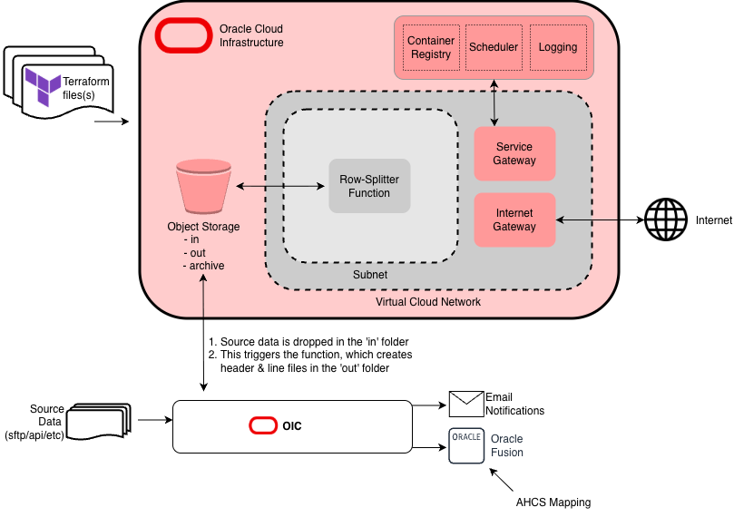

# OIC Services

## Purpose

OIC Helper functions:
- Row Splitter - splits input data into the header/detail format required by ESS upload job

## Architecture



Words...

| Resource      | Purpose |
| ------------- |:-------------:|
| [Container Registry & Repository](https://docs.oracle.com/en-us/iaas/Content/Registry/Concepts/registryoverview.htm) | Used to store the container image |
| [VCN & Subnet](https://docs.oracle.com/en-us/iaas/Content/Network/Concepts/overview.htm) | Secure hosting of OIC Function Service |
| [Service Gateway](https://docs.oracle.com/en-us/iaas/Content/Network/Tasks/servicegateway.htm) | Allows ftp-bridge service access to required OCI services (eg. Container Registry) |
| [OCI Function](https://docs.oracle.com/en-us/iaas/Content/Functions/Concepts/functionsoverview.htm) | The ftp-bridge Service itself (serverless function) |
| [Service Log](https://docs.oracle.com/en-us/iaas/Content/Logging/Concepts/loggingoverview.htm) | Logging for the ftp-bridge service |

### Prepare the Repo

#### Create 'terraform.tfvars' file as follows

``` text
compartment_id      = "<your_compartment_OCID_here>"
region              = "uk-london-1"
tenancy_ocid        = "<your_tenancy_id_here>"
logging_group_id    = "<your_logging_group_id_here>"
image_path          = "<docker image path> (see below)"
```

### Deploy Docker Image

``` shell
docker login lhr.ocir.io
docker build --platform=linux/amd64 -t lhr.ocir.io/[repositoryNamespace]/row-splitter:0.1.0 .
docker push lhr.ocir.io/[repositoryNamespace]/row-splitter:0.1.0
```

(you may want to move the docker image to correct compartment if this is your first time pushing) <br>
Now update the `terraform.tfvars` file with the image path

### Deploy Infrastructure

``` shell
oci session authenticate (then choose 70, then type DEFAULT)
oci session authenticate (then choose 70, then type OCITF)
terraform apply
```

## Row Splitter Function

### Purpose

This function is triggered by an OCI Object Storage `Create Object` event.

For each input file, it:

1. Loads the matching config YAML from Object Storage.
2. Loads and parses the input file.
3. Applies the splitting rules.
4. Uploads `XlaTransactionUpload.zip` to the output prefix.
5. Uploads `done.trg` to the same output prefix.

### Supported Input Files

- `.csv`
- `.xls`
- `.xlsx`
- `.json`

### Object Naming Conventions

#### Input file path

Input files must be stored under a path beginning with `in/`.

Example:

```text
in/supplier_invoice/test_data.csv
```

#### Config YAML path

The config name is taken from the input file's parent directory.

Example input:

```text
in/supplier_invoice/test_data.csv
```

Expected config YAML:

```text
config/supplier_invoice/config.yaml
```

#### Output path

The output prefix is created by replacing `in/` with `out/` and removing the input filename.

Example input:

```text
in/supplier_invoice/test_data.csv
```

Output prefix:

```text
out/supplier_invoice/
```

Output objects:

```text
out/supplier_invoice/test_data_20260703150334.zip
out/supplier_invoice/done.trg
```

## Config YAML Requirements

The config YAML must contain:

- `metadata`
- `groups`
- `header`
- `line`

Example metadata:

```yaml
metadata:
  name: TEST_PROCESS
  version: 3
```

### Grouping

The config uses named `groups` definitions.

Example named group:

```yaml
groups:
  transaction:
    groupBy:
      - C6
      - C7
    key:
      prefix: LCKTRELW
      start: 10000000002000
    count:
      prefix: ''
      start: 1
```

Use the group key and count in `header` or `line` with `fromGroup`:

```yaml
TRANSACTION_NUMBER:
  fromGroup: transaction.key
LINE_NUMBER:
  fromGroup: transaction.count
```

If only one group is defined, you may omit the group name and use `fromGroup: key` or `fromGroup: count`.

### Output Layouts

Each output section may define `group` and `mode` to control how records are generated.

```yaml
header:
  group: transaction
  mode: group
  TRANSACTION_NUMBER:
    fromGroup: transaction.key

line:
  group: transaction
  mode: row
  TRANSACTION_NUMBER:
    fromGroup: transaction.key
  LINE_NUMBER:
    fromGroup: transaction.count
```

- `group` selects the named group that drives this output section.
- `mode` controls record generation:
  - `group` => one output record per group
  - `row` => one output record per source row within each group

If `mode` is omitted, `header` defaults to `group` and `line` defaults to `row`.

See [examples/config.example.yaml](examples/config.example.yaml) for a complete example.

`header` and `line` support explicit fields plus repeating field ranges.

A repeating block uses a `prefix`, a starting index, and either `end` or `size`. Named fields inside the block replace the first generated positions, and the remaining positions are filled with generic values.

Example:

```yaml
groups:
  transaction:
    groupBy:
      - C6
      - C7
    key:
      prefix: TEST
      start: 10000000000000
    count:
      prefix: ''
      start: 1

header:
  TRANSACTION_NUMBER:
    fromGroup: transaction.key
  EVENT_TYPE_CODE:
    value: JOURNAL_BALANCES
  LEDGER_NAME:
    value: TR ACTUALS USD Apr
  TRANSACTION_DATE:
    from: C6
    transform: ddmmyyyy_to_yyyymmdd

  repeat:
    - prefix: Character
      start: 1
      end: 50
      fields:
        EVENT_TYPE:
          value: BALANCE
        REVERSAL_FLAG:
          value: N
        SOURCE_SYSTEM_NAME:
          value: TEST TB
        SOURCE_SYSTEM_FILE_NAME:
          fromRoot: basename

    - prefix: Long Character
      start: 1
      end: 5
      fields:
        DETAIL:
          from: C9
```

The example above expands to:

- `TRANSACTION_NUMBER`
- `EVENT_TYPE_CODE`
- `LEDGER_NAME`
- `TRANSACTION_DATE`
- `EVENT_TYPE`
- `REVERSAL_FLAG`
- `SOURCE_SYSTEM_NAME`
- `SOURCE_SYSTEM_FILE_NAME`
- `Character4` through `Character50`
- `DETAIL`
- `Long Character2` through `Long Character5`

Repeat blocks can also be used in `line`:

```yaml
line:
  TRANSACTION_NUMBER:
    fromGroup: transaction.key
  LINE_NUMBER:
    fromGroup: transaction.count

  repeat:
    - prefix: Character
      start: 1
      end: 100
      fields:
        DEFAULT_CURRENCY:
          from: C14
        COST_CENTRE_CODE:
          from: C1
        COST_CENTRE_NAME:
          from: C2
        TYPE:
          from: C8
        ACCOUNT_NAME:
          from: C4
    - prefix: Number
      start: 1
      end: 30
      fields:
        DEFAULT_AMOUNT:
          expr: number(C16) - number(C17)
          format: currency
        LINE_NO: ''
        LOCAL_ACCOUNT_CODE:
          from: C3
        ENTITY:
          value: '263200'
        VOUCHER_NUMBER:
          from: C7
        ACCOUNTED_AMOUNT:
          expr: number(C10) - number(C11)
          format: currency
        ACCOUNT_CODE:
          from: C3
    - prefix: Date
      start: 1
      end: 10
      fields:
        VOUCHER_DATE:
          from: C6
          transform: ddmmyyyy_to_yyyymmdd
```

The repeating block key may be `repeat` or `repeating`.

### Structure Options

The optional `structure` block controls how worksheet columns are mapped.

```yaml
structure:
  headerRowPresent: true
  ignoreHeaderRow: true
```

Behavior:

- `headerRowPresent: true` and `ignoreHeaderRow: true`: skip the first row and use `C1`, `C2`, `C3`, and so on.
- `headerRowPresent: true` and `ignoreHeaderRow: false` or omitted: skip the first row and use the first row values as property names.
- `headerRowPresent: false`: treat the first row as data and use `C1`, `C2`, `C3`, and so on.
- If `structure` is omitted, both values are treated as `false`.

### YAML Field Sources

Supported source options:

- `value`
- `from`
- `fromRoot`
- `fromGroup`
- `sequence`
- `expr`

Examples:

```yaml
SOURCE_SYSTEM_FILE_NAME:
  fromRoot: filename

SOURCE_SYSTEM_BASENAME:
  fromRoot: basename

DETAIL:
  from: C9
```

Available root fields include:

- `filename`: full input object path
- `basename`: input filename only

### Date Transform

The `ddmmyyyy_to_yyyymmdd` transform accepts both padded and abbreviated dates.

Examples:

- `09/02/2026` -> `2026/02/09`
- `9/2/26` -> `2026/02/09`
- `2/1/26` -> `2026/01/02`

### Output Files

The function uploads:

- `XlaTransactionUpload.zip`
- `done.trg`

The zip contains:

- `XlaTrxH.csv`
- `XlaTrxL.csv`
- `Metadata_<metadata.name>.txt`

### Event Payload Requirements

The function expects these Object Storage event fields:

- `data.resourceName`
- `data.additionalDetails.bucketName`
- `data.additionalDetails.namespace`

### Logs

Function logs are available through OCI Logging.

To view them:

1. Open `Developer Services -> Functions -> Applications`.
2. Select the application.
3. Open the `Monitoring` tab.
4. Open the function invocation log.

### Test Flow

1. Build the docker image.
2. Push the docker image.
3. Apply the terrform.
4. Upload a config file to config/{filetype}/config.yaml
5. Upload an input file to in/{filetype}/ .
6. Confirm that the output prefix contains:
   - `XlaTransactionUpload.zip`
   - `done.trg`


## Notes & Links

- Terraform:
    - https://docs.oracle.com/en-us/iaas/Content/dev/terraform/home.htm
    - https://developer.hashicorp.com/terraform/tutorials/oci-get-started
    - https://docs.oracle.com/en-us/iaas/Content/dev/terraform/tutorials/tf-simple-infrastructure.htm
    - https://registry.terraform.io/providers/oracle/oci/latest/docs
    - https://docs.oracle.com/en/cloud/foundation/iac/index.html#deployment-architectures
- OCI CLI, Functions & Docker:
    - https://developer.hashicorp.com/terraform/tutorials/oci-get-started/oci-build
    - https://docs.oracle.com/en-us/iaas/Content/Functions/home.htm
    - https://fnproject.io/tutorials/node/intro/
    - https://docs.docker.com/get-started/
- To list compartments: `oci iam compartment list --config-file /Users/[your username]]/.oci/config --profile DEFAULT --auth security_token --compartment-id-in-subtree true`
- To refresh OCI auth token: `oci session refresh --profile OCITF`
- To manually invoke the function: `fn invoke ftp-bridge-application ftp-bridge-function`
